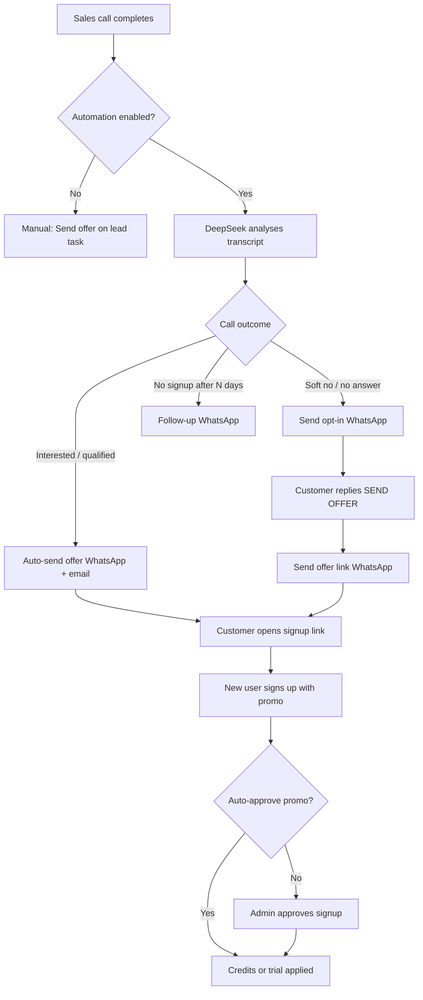

# WhatsApp sales workflow (VOXBULK)

This document describes how WhatsApp is used for **lead sales** — from outbound sales calls through promo signup. It does not cover **survey campaign** WhatsApp (customer dashboard surveys), which uses a separate dispatch flow.

---

## Overview

---

## Prerequisites

1. **Telnyx** configured under Admin → Integrations → Telnyx (WhatsApp from-number, messaging webhook).
2. **Lead sales setup** → WhatsApp sales automation **enabled**.
3. WhatsApp templates under **Settings → Email & messaging → WhatsApp**:
   - `sales_opt_in`
   - `sales_offer`
   - `sales_offer_followup`
   - `sales_offer_keyword_confirm`

---

## Phase 1 — After the sales call

When a lead sales call finishes, the system:

1. Syncs the Telnyx transcript (or uses stored transcript).
2. Runs **DeepSeek** to produce `outcome_json` (`deal_stage`, `interested_to_buy`, summary, etc.).
3. Runs **post-call automation** (`SalesAutomationService.handle_post_call`).

### Automatic decisions

| Transcript outcome | WhatsApp action |
|-------------------|-----------------|
| `interested_to_buy` = true, or stage = `won_intent`, `demo_booked`, `qualified` | **Send offer immediately** (email + WhatsApp with signup link) |
| Call `no_answer`, or stage = `follow_up`, `not_interested` | **Send opt-in** — ask customer to reply **SEND OFFER** |
| Offer already sent for this task | Skip |
| Automation paused on lead | Skip |

### Configure automation

**Marketing → Lead sales → Lead sales setup → WhatsApp sales automation**

| Setting | Purpose |
|---------|---------|
| Enable post-call WhatsApp automation | Master switch |
| Auto-offer plan code | Subscription plan for auto-offers (e.g. `dental_1`) |
| Auto-offer trial days | Trial length on subscription promos |
| No-signup follow-up (days) | Send reminder if promo unused (default 7) |

Manual override: open the lead task → **Send offer link**.

---

## Phase 2 — Outbound message types

### Opt-in (`sales_opt_in`)

Sent when the call did not close hot. Message asks the prospect to reply **SEND OFFER** to receive the signup link later.

### Offer (`sales_offer`)

Sent when:

- Post-call automation detects strong interest, or
- Agent clicks **Send offer link** on the lead task.

Includes promo name, offer line (trial / survey credits / interviews), signup URL.

### Keyword confirm (`sales_offer_keyword_confirm`)

Sent when the customer replies with offer keywords (e.g. “send offer”, “send link”) and an offer was already created for that task.

### Follow-up (`sales_offer_followup`)

Sent if the promo link was sent but **not redeemed** within the configured follow-up days.

---

## Phase 3 — Customer replies on WhatsApp

Inbound messages hit **Telnyx → `/telnyx/webhooks/messages` → `SalesAutomationService.handle_inbound_whatsapp`**.

Phone number is matched to a **lead sales task**.

| Customer message | System response |
|------------------|-----------------|
| **STOP** / unsubscribe | Opt-out confirmation; no further automation |
| **SEND OFFER** / “send me offer” / “send link” | Resend or first-send offer link via WhatsApp |
| Help / confused / problem (or after offer sent) | **AI help reply** (DeepSeek) with signup URL |
| Anything else | Logged on lead; **no auto-reply** |

**Note:** Messages are **text + keyword based**, not WhatsApp quick-reply buttons. Customers type **SEND OFFER**; they do not tap a button (Meta template buttons are not wired yet).

---

## Phase 4 — Signup and promo redemption

1. Customer opens `https://voxbulk.com/signin?promo=CODE`.
2. Signs up as a **new organisation** (self-serve).
3. On admin approval (or auto-approve if enabled), promo is redeemed:

| Promo type | What the customer gets |
|------------|------------------------|
| Subscription trial | Plan + usage wallet (calls / WhatsApp / SMS) |
| Survey credits | Balance on org → used when launching survey orders in dashboard |
| Interview credits | Balance on org → used when launching interview orders |

Survey/interview credits: dashboard prompts **Use promo credits** when uploading contacts if balance covers the order.

---

## Promo types (Marketing → Promo offers)

| Type | Example | Signup requirement |
|------|---------|-------------------|
| Subscription plan trial | Dental P1, 15-day trial | Plan selected |
| Free survey contacts | 20 survey contacts | No subscription required |
| Free interviews | 3 interviews | No subscription required |

Promos are **new users only** (signup redemption).

---

## Troubleshooting

| Issue | Check |
|-------|--------|
| No WhatsApp after call | Lead sales setup → automation on; task has phone; sync outcome on task |
| Opt-in sent but no link on reply | Customer must reply **SEND OFFER** (exact keyword patterns) |
| WhatsApp not delivered | Integrations → Telnyx → test WhatsApp; inbound messages table |
| Wrong offer text | Settings → WhatsApp templates; placeholders `{{offer_line}}`, `{{signup_url}}` |
| Credits not in dashboard | Signup approved; migration 0059+ applied; redeem ran (check promo redemption count) |

---

## Related admin paths

- **Integrations → Telnyx** — WhatsApp sending + webhooks
- **Marketing → Lead sales → Setup** — automation rules
- **Marketing → Promo offers** — create survey / interview / subscription promos
- **Settings → WhatsApp templates** — message copy
- **Marketing → Lead sales → [task]** — manual send offer, sync outcome, automation pause
