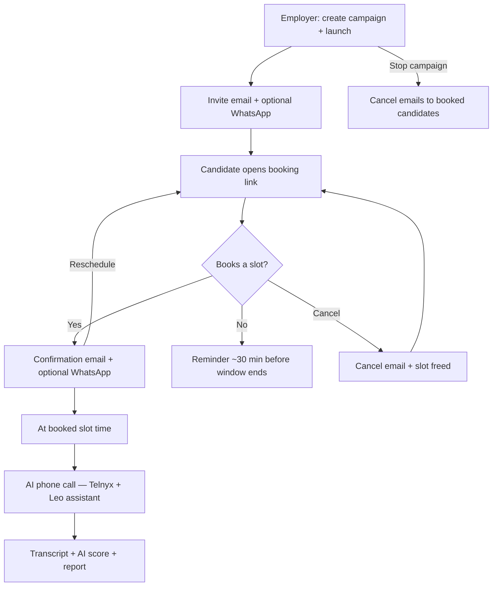

# AI interview workflow (email + WhatsApp + call + report)

All times shown to candidates are **UK time (Europe/London)**. Slots are stored in UTC with a `Z` suffix in the API.

## Simple flow



## Step detail

| Step | Channel | What happens |
|------|---------|----------------|
| 1. Launch | Dashboard | Campaign `running`; invite sent |
| 2. Invite | **Email** (SMTP careers@) | Link to `/book/{token}` — book interview |
| 2b. Invite | **WhatsApp** (optional) | Same booking link if number is WA-enabled |
| 3. Book | Public booking page | Candidate picks **4-minute** slot (config: `INTERVIEW_SLOT_MINUTES`) |
| 4. Confirm | **Email** | Booking time in UK; add-to-calendar: Google, Outlook, Apple (.ics) |
| 4b. Confirm | **WhatsApp** (optional) | Confirmation template with reschedule/cancel |
| 5. Reminder | Email / WA | ~30 minutes before call (if configured) |
| 6. Call | Phone | Scheduler dials at slot; AI assistant speaks |
| 7. Results | Dashboard | Transcript, score, recommendation, recording |

## Candidate status (backend)

| Status | Meaning |
|--------|---------|
| `pending` / `sent` | Invited, not called yet |
| `scheduled` | Slot booked — eligible for dial at slot time |
| `calling` | On the phone now |
| `completed` | Call finished — report when analysis runs |

## Configuration (VPS)

In `voxbulk-api/.env` on the server:

```env
INTERVIEW_SLOT_MINUTES=4
INTERVIEW_RELAX_HOURS=1
BOOKING_APP_ORIGIN=https://dashboard.voxbulk.com
```

**4-minute slots, 24 hours a day (testing):**

| Setting | Effect |
|---------|--------|
| `INTERVIEW_SLOT_MINUTES=4` | Booking grid every 4 minutes |
| `INTERVIEW_RELAX_HOURS=1` | No 9:00–17:30 UK cap; AI can dial anytime |
| Launch | API extends calling end to **at least 24h** after start if the window was shorter |

In the dashboard, set **Calling start** to now (or today 00:00) and **Calling end** at least 24h later — launch will auto-extend the end time when relax mode is on.

Restart API after changing `.env`.

Restart API after changing env.

## Telnyx

- Interview agent must use a **valid** Telnyx assistant ID (e.g. `Leo- Interview` in portal).
- Stored on agent row `telnyx_assistant_id` in Admin → Agents.

## Email templates (careers@voxbulk.com)

| Event | Template key | When sent |
|-------|----------------|-----------|
| Launch | `interview_booking_invite` | `POST …/interview/launch` or `…/interview-booking/send-invites` |
| Book slot | `interview_booking_confirm` | Candidate confirms/reschedules |
| Reminder | `interview_booking_reminder` | ~30 min before slot |
| Candidate cancels slot | `interview_booking_cancel` | Cancel link / WhatsApp |
| Employer stops campaign | `interview_campaign_cancelled` (invited only) or `interview_booking_cancel` (had booked slot) | `POST …/stop` — **synchronous** (not background) |

All use `CareerEmailService.send_templated_critical` (admin template, then code default if disabled).

Stop campaign requires proof of outreach: `booking_invites_sent_at`, `last_invite_dispatch`, or per-candidate `invite_email_sent_at` / `booking_url` / WA token.

## Before pushing to GitHub

1. Run tests: `pytest tests/test_interview_booking_slots.py tests/test_interview_calendar_service.py -q`
2. On VPS: set `INTERVIEW_SLOT_MINUTES=4`, deploy, restart API
3. Send one test confirmation email and check calendar icons in Outlook + Apple Mail
