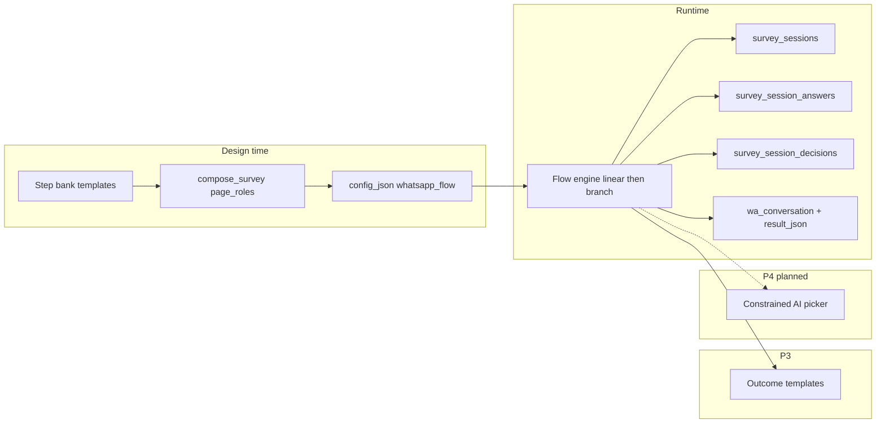
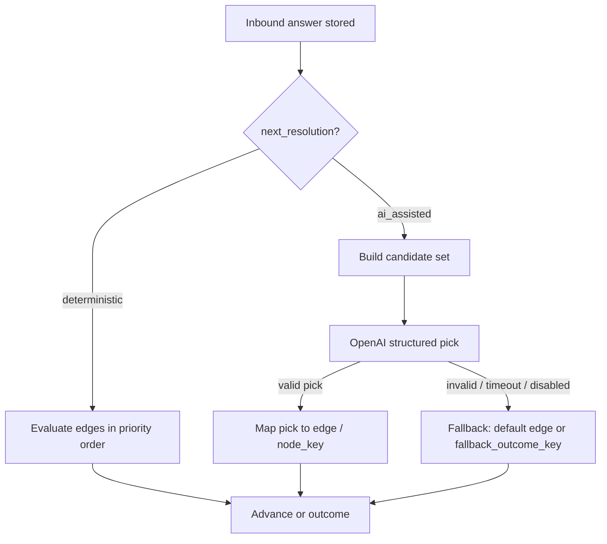

# WA Survey Adaptive Engine

Technical design for the controlled conversational WhatsApp survey runtime. This is **not** an open-ended chatbot: every turn is one approved question from the step bank, with deterministic branching first and optional constrained AI selection later.

## Product principles

| Principle | Meaning |
|-----------|---------|
| Approved step bank only | Runtime never invents questions; it selects from templates scoped by **industry**, **survey type**, and **privacy mode**. |
| One question per turn | Each inbound reply advances at most one middle step (plus intro/completion templates). |
| Deterministic branching first | Rules and edges are explicit before any AI picker. |
| Outcome → template/action | Final path (happy / neutral / unhappy) triggers the correct closing or follow-up template. |
| No unbounded chat | AI may only choose among allowed `step_role` values in the bank, never free-form survey content. |

## Current codebase anchors

| Layer | Location | Role today |
|-------|----------|------------|
| Step bank (design time) | `survey_step_bank_service.py` | 12-template pack (8 middle + start + 3 outcomes); compose 4–6 `page_roles` into `whatsapp_flow`. |
| Order config | `service_orders.config_json` | Frozen `whatsapp_flow.questions`, `page_roles`, intro/closing. |
| Linear runtime | `survey_whatsapp_conversation_service.py` | `wa_conversation.step` 1→N; mirrors answers in `result_json`. |
| Reporting | `survey_results_service.py` | Aggregates `extracted_answers` / `wa_conversation.answers`. |

## Target architecture



## Scoping: Industry + Survey Type + Privacy Mode

The step bank loader (`load_step_bank`) filters `telnyx_whatsapp_templates` and mappings by:

- `survey_types.industry_id`
- `survey_type_id`
- `privacy_mode` / variant (`standard` vs `anonymous`)

Runtime session rows snapshot `survey_type_id`, `privacy_mode`, and `page_roles_json` so historical sessions remain interpretable even if the bank changes later.

## Why runtime AI is constrained

| Anti-pattern | Why we avoid it |
|--------------|-----------------|
| LLM generates the next question text | Breaks Meta template approval and brand/compliance control. |
| Unlimited follow-up questions | Unbounded cost, GDPR surface, and “chatbot” UX instead of a short survey. |
| Cross-industry template reuse at runtime | Violates scoping rules; causes wrong tone and wrong branching keys. |
| Skipping the decision log | Cannot audit or debug why a recipient saw a given question. |
| Replacing `result_json` in one cut | Breaks existing dashboards, exports, and in-flight orders. |

Allowed future AI role: **picker only** — given current answers and allowed `step_role` candidates from the bank, return one role ID; the engine still loads template body from the bank.

## Phased delivery

### P1 — Session persistence (linear) ✅

**Goal:** Structured storage and decision log while behaviour stays linear.

| Artifact | Purpose |
|----------|---------|
| `survey_sessions` | One row per recipient survey run (`recipient_id` unique). |
| `survey_session_answers` | Append-only normalized answers (`sequence`, `step_role`, `node_key`). |
| `survey_session_decisions` | Append-only log (`picker=deterministic`, `rule_key` e.g. `linear.advance`). |

**Compatibility:** `result_json` still receives `wa_conversation`, `extracted_answers`, and optional `survey_session_id`. Reporting continues to use JSON; sessions are the source of truth for future features.

**Migration:** `0092_wa_survey_sessions_p1`

### P2 — Deterministic graph runtime ✅

**Migration:** `0093_wa_survey_flow_graph_p2`

| Table | Purpose |
|-------|---------|
| `survey_flow_definitions` | Published flow library per `survey_type` + `privacy_mode` |
| `survey_flow_nodes` | `question` / `outcome` nodes (`step_role` unique per flow) |
| `survey_flow_edges` | Priority-ordered conditions + one default edge per question |
| `survey_flow_outcomes` | `happy` \| `neutral` \| `unhappy` → `send_text` / `send_template` |

**Session extensions:** `flow_definition_id`, `flow_snapshot_json`, `current_node_key`, `question_visits`

**Activation:** `flow_engine=graph` on order config + valid `flow_snapshot`. Default remains `linear`.

**Storage (A3):** DB definition → order `config_json.flow_snapshot` → session `flow_snapshot_json` at start.

**Auto-compile:** `compile_linear_graph()` when `flow_engine=graph` without `flow_definition_id`.

**Admin API:** `GET/POST /types/{id}/flows`, `GET/PUT /flows/{id}`, `POST .../validate`, `POST .../publish`

### P3 — Outcome template delivery ✅

**Migration:** `0094_wa_survey_outcome_templates_p3`

| Change | Purpose |
|--------|---------|
| `telnyx_whatsapp_templates.outcome_key` | `happy` \| `neutral` \| `unhappy` on `step_role=completion` |
| `telnyx_whatsapp_templates.outcome_variables_json` | Per-template placeholder → context key map |
| `survey_sessions.outcome_delivery_json` | Idempotent send log |
| Pack size **12** | 8 middle + start + 3 completion outcomes |

**Runtime:** Graph mode only — `SurveyOutcomeSendService` sends WhatsApp template (or text fallback). Linear unchanged.

### P4 — Constrained AI picker ✅

**Status:** Implemented. Migration `0095_wa_survey_ai_picker_p4`. Browser test via admin simulator (`/settings/wa-survey/simulator` on port **5174**).

**Goal:** When a graph node is configured for assisted routing, the engine asks a constrained model call to choose **one** next destination from an explicit candidate set. The model never writes question text, never invents roles, and never bypasses industry / survey-type / privacy scoping.

#### Non-goals (P4)

| Out of scope | Reason |
|--------------|--------|
| Free-form next question text | Meta template approval + bank-only principle |
| Replacing deterministic edges globally | Deterministic branching remains default |
| AI inventing new outcome paths | Model may only pick an outcome **already wired** as an outgoing edge candidate |
| Linear flow picker | Linear stays fixed `page_roles` order |
| Cross-industry or cross-privacy template pick | Same scoping rules as bank loader |
| Unbounded follow-ups | `max_question_visits` + visited-role caps still enforced |

#### Activation gates (all required)

Runtime stays **deterministic by default**. The picker runs only when **every** gate passes:

| Gate | Rule |
|------|------|
| Flow mode | `flow_engine=graph` on order config (linear never invokes picker) |
| Node flag | Current question node has `next_resolution: "ai_assisted"` |
| Order switch | `config_json.ai_picker_enabled === true` (default `false`) |
| Platform kill switch | Platform setting `wa_survey_ai_picker_enabled !== false` (default **on** at platform level; set `false` to disable **all** picker calls globally) |
| Session cap | `picker_invocations < 3` for this `survey_session` (count stored via decision log or session counter at implement time) |
| P3 prerequisite | P3 outcome delivery validated in production-like E2E before P4 ships |

If any gate fails, use the existing deterministic edge walk (no model call).

#### When the picker runs

In eligible graph sessions, **after** an answer is stored and **before** `_advance_to_node`, when the current question node has:

```json
"next_resolution": "ai_assisted"
```

If `next_resolution` is omitted or `deterministic`, behaviour is unchanged (today’s edge walk).

**Trigger flow:**



#### Candidate set (hard constraint) — confirmed: outgoing edges only

Candidates are **only** destinations reachable via **outgoing edges** from `current_node_key` in the session snapshot. The model cannot jump to a role that is not already an edge target.

Filter each outgoing edge target through:

1. **Edge exists** in snapshot `edges_by_from[current_node_key]` (including default edge with `condition_json: null`).
2. **Not yet visited** for question targets (`survey_session_answers.step_role`), unless revisiting is explicitly allowed later (P4: skip revisits).
3. **Outcome edges allowed:** if `to_node_key` is an outcome node (`outcome_happy` / `outcome_neutral` / `outcome_unhappy`), it remains a valid candidate **only when that edge is already drawn** in the graph. The model may choose it directly; no free-form outcome inference.
4. **Bank coverage** for question targets: scoped step bank `(survey_type_id, privacy_mode, industry_id)` has a sendable template for that `step_role`.
5. **`max_question_visits`:** if the only remaining candidates are questions but visits are exhausted, remove question candidates and coerce fallback to `fallback_outcome_key` (or default outcome edge if present).

If the filtered set is empty or has one member, **skip the model** and take the sole candidate or deterministic fallback.

The picker receives **only**:

| Field | Source |
|-------|--------|
| `session_id`, `current_node_key`, `visit_num` | `survey_sessions` |
| `answers_summary` | Last N `survey_session_answers` (`step_role`, `normalized_value`) |
| `candidates` | `[{ "node_key", "step_role", "edge_rule_key", "kind": "question"|"outcome" }]` |
| `survey_type_slug`, `privacy_mode` | Session / order config |
| Optional `picker_hint` | Admin string on flow definition (max ~500 chars) |

**Model output schema (structured JSON):**

```json
{ "chosen_node_key": "reason", "confidence": 0.82, "rationale": "short audit string" }
```

`chosen_node_key` **must** be in `candidates`; otherwise reject and fallback.

#### Fallback order (deterministic safety net)

1. Default edge (`condition_json == null`) on current node, if present.
2. First conditional edge that matches (existing evaluator) — only if picker was skipped due to config, not after a failed pick.
3. `snap.fallback_outcome_key` (default `neutral`).
4. Log `picker=deterministic` with `rule_key=ai_picker.fallback` and reason code.

Never block session completion because the picker failed.

#### Decision log (P1 table, no schema change required)

| `picker` | `decision_kind` | `rule_key` examples |
|----------|-----------------|---------------------|
| `deterministic` | (unchanged) | `branch.eval`, `graph.max_visits`, … |
| `ai_assisted` | `branch_picker_invoke` | `ai_picker.request` |
| `ai_assisted` | `branch_picker_result` | `ai_picker.chosen` |
| `deterministic` | `branch_picker_result` | `ai_picker.fallback` |

`context_json` must include: `candidates`, model id, latency ms, chosen key, fallback reason (if any). **No raw prompt storage** in P4 (optional hash only).

#### Config / storage (proposed at implement time — no migration in design phase)

**Preferred: snapshot-only (no new tables in P4 v1)**

Extend published `flow_snapshot` nodes:

```json
{
  "node_key": "rating",
  "node_type": "question",
  "step_role": "rating",
  "next_resolution": "ai_assisted",
  "picker_hint": "Prefer reason after low scores; prefer outcome_unhappy if rating <= 6."
}
```

Order-level overrides in `config_json` (optional):

| Key | Default | Meaning |
|-----|---------|---------|
| `ai_picker_enabled` | `false` | Master switch per order |
| `ai_picker_model` | platform OpenAI default | Provider row |
| `ai_picker_timeout_ms` | `8000` | Hard cap; fallback on timeout |

**Platform kill switch** (confirmed): store in platform/provider settings (e.g. `ProviderSettingsService` key `wa_survey_ai_picker_enabled`). When `false`, `survey_flow_picker_service` returns immediately with `skipped_reason=platform_disabled` and deterministic fallback — no OpenAI call.

**Session cap** (confirmed): max **3** picker invocations per `survey_session`. On the 4th `ai_assisted` node, skip model and use deterministic fallback; log `rule_key=ai_picker.cap_exceeded`.

Flow-definition-level default in `survey_flow_definitions.metadata_json` (new nullable `Text` column — **only if** admins need library-level defaults without republishing snapshots; otherwise defer).

**Session:** optional `picker_invocation_count` on `survey_sessions` at implement time, or derive from decision log (`branch_picker_invoke` count); decision log remains audit source of truth.

#### Services (proposed layout)

| Service | Responsibility |
|---------|----------------|
| `survey_flow_picker_service.py` (new) | Build candidates, call `OpenAIProviderService.responses_json` with strict schema, validate pick |
| `survey_flow_engine_service.py` | Branch in `process_inbound_answer` when `next_resolution == ai_assisted` |
| `survey_step_bank_service.py` | `list_available_roles_for_session()` — scoped bank ∩ not visited |
| `survey_flow_definition_service.py` | Validate: `ai_assisted` nodes must have ≥2 outgoing edges; warn if bank missing template for a candidate role |

#### Admin / API (proposed)

| Endpoint | Purpose |
|----------|---------|
| `POST /types/{id}/flows/{flow_id}/picker-preview` | Dry-run: given mock answers JSON, return candidates + model pick (no send) |
| Extend `POST .../validate` | Warnings for `ai_assisted` nodes without bank coverage |
| Extend `generate-preview` | Flag when `flow_branches` + `ai_picker_enabled` would activate picker |

Requires `CAP_INTEGRATION` (same as other WA survey admin routes).

#### Confirmed product decisions (2026-06-03)

| # | Decision | Choice |
|---|----------|--------|
| 1 | Candidate scope | **Outgoing edges only** — no unvisited roles unless already an edge target |
| 2 | Outcome edges | **Yes** — model may pick an outcome node **only if** it is already among outgoing edge candidates |
| 3 | Per-session cap | **Max 3** picker invocations; then deterministic fallback |
| 4 | Kill switch | **Yes** — platform-wide disable (`wa_survey_ai_picker_enabled=false`) |
| 5 | Default runtime | **Deterministic**; picker only behind graph + `next_resolution: ai_assisted` + order flag |
| 6 | Implementation gate | **Wait for P3 E2E sign-off** before any P4 code or migration |

### P5+ — Future

- Richer admin graph UI (visual editor, edge tester)
- Per-org picker analytics dashboard
- Optional prompt templates per survey type

## P1 schema summary

### `survey_sessions`

| Column | Notes |
|--------|-------|
| `recipient_id` | Unique — one session row per list recipient |
| `flow_mode` | `linear` in P1 |
| `current_step` / `total_steps` | Mirrors `wa_conversation` |
| `page_roles_json` | Snapshot from order config |
| `status` | `active` → `completed` |

### `survey_session_answers`

| Column | Notes |
|--------|-------|
| `sequence` | Strictly increasing per session (append-only) |
| `step_role` | Normalized via `normalize_step_role` / `page_roles` |
| `node_key` | `{step_role}@{step_index}` |
| `raw_value` / `normalized_value` | Inbound text vs `match_answer` result |

### `survey_session_decisions`

| Column | Notes |
|--------|-------|
| `decision_kind` | `start_session`, `send_question`, `record_answer`, `advance_linear`, `complete_session` |
| `rule_key` | e.g. `linear.advance`, `linear.complete` |
| `picker` | `deterministic` in P1 |

## Services (P1)

| Service | Responsibility |
|---------|----------------|
| `survey_session_service.py` | Create session, append answers/decisions, resolve `step_role` |
| `survey_whatsapp_conversation_service.py` | Calls session service; unchanged external behaviour |

## API changes (P1)

None required. Sessions are written internally during WhatsApp inbound/outbound handling. Admin/dashboard read APIs for sessions may be added in P2+.

## Tests (P1)

`tests/test_survey_session_p1.py` — session creation, append-only answers, decision kinds, `result_json` compatibility.

## Internal browser simulator (no OpenAI / no WhatsApp)

| Item | Location |
|------|----------|
| Test pack seed | `SurveyWaTestPackSeedService` — Industry **Services**, Survey type **General**, privacy **off**, 12 APPROVED local templates |
| CLI seed | `python scripts/seed_wa_survey_test_pack.py` or `POST /admin/wa-survey/test-pack/ensure` |
| Admin UI | `http://localhost:5174/settings/wa-survey/simulator` (admin Vite dev — **not** port 5173) |
| API | `GET /admin/wa-survey/simulator/options`, `POST .../simulator/start`, `POST .../simulator/answer` |

Runtime uses `simulator_dry_run` on order config — same `handle_inbound_reply` / graph engine / outcome delivery, without Telnyx sends.

## Operations

See [wa-survey-operations-runbook.md](./wa-survey-operations-runbook.md) for admin URLs, observability endpoints, picker controls, and staging→prod checklist.
