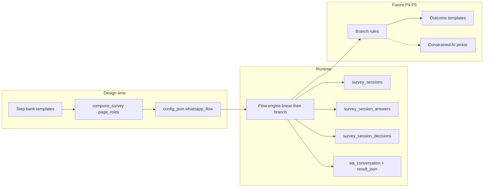

# WA Survey Adaptive Engine

Technical design for the controlled conversational WhatsApp survey runtime. This is **not** an open-ended chatbot: every turn is one approved question from the step bank, with deterministic branching first and optional constrained AI selection later.

## Product principles

| Principle | Meaning |
|-----------|---------|
| Approved step bank only | Runtime never invents questions; it selects from templates scoped by **industry**, **survey type**, and **privacy mode**. |
| One question per turn | Each inbound reply advances at most one middle step (plus intro/completion templates). |
| Deterministic branching first | Rules and edges are explicit before any AI picker. |
| Outcome → template/action | Final path (happy / neutral / unhappy) triggers the correct closing or follow-up template. |
| No unbounded chat | AI may only choose among allowed `step_role` values in the bank, never free-form survey content. |

## Current codebase anchors

| Layer | Location | Role today |
|-------|----------|------------|
| Step bank (design time) | `survey_step_bank_service.py` | 10-role pack; compose 4–6 `page_roles` into `whatsapp_flow`. |
| Order config | `service_orders.config_json` | Frozen `whatsapp_flow.questions`, `page_roles`, intro/closing. |
| Linear runtime | `survey_whatsapp_conversation_service.py` | `wa_conversation.step` 1→N; mirrors answers in `result_json`. |
| Reporting | `survey_results_service.py` | Aggregates `extracted_answers` / `wa_conversation.answers`. |

## Target architecture

## Scoping: Industry + Survey Type + Privacy Mode

The step bank loader (`load_step_bank`) filters `telnyx_whatsapp_templates` and mappings by:

- `survey_types.industry_id`
- `survey_type_id`
- `privacy_mode` / variant (`standard` vs `anonymous`)

Runtime session rows snapshot `survey_type_id`, `privacy_mode`, and `page_roles_json` so historical sessions remain interpretable even if the bank changes later.

## Why runtime AI is constrained

| Anti-pattern | Why we avoid it |
|--------------|-----------------|
| LLM generates the next question text | Breaks Meta template approval and brand/compliance control. |
| Unlimited follow-up questions | Unbounded cost, GDPR surface, and “chatbot” UX instead of a short survey. |
| Cross-industry template reuse at runtime | Violates scoping rules; causes wrong tone and wrong branching keys. |
| Skipping the decision log | Cannot audit or debug why a recipient saw a given question. |
| Replacing `result_json` in one cut | Breaks existing dashboards, exports, and in-flight orders. |

Allowed future AI role: **picker only** — given current answers and allowed `step_role` candidates from the bank, return one role ID; the engine still loads template body from the bank.

## Phased delivery

### P1 — Session persistence (linear) ✅

**Goal:** Structured storage and decision log while behaviour stays linear.

| Artifact | Purpose |
|----------|---------|
| `survey_sessions` | One row per recipient survey run (`recipient_id` unique). |
| `survey_session_answers` | Append-only normalized answers (`sequence`, `step_role`, `node_key`). |
| `survey_session_decisions` | Append-only log (`picker=deterministic`, `rule_key` e.g. `linear.advance`). |

**Compatibility:** `result_json` still receives `wa_conversation`, `extracted_answers`, and optional `survey_session_id`. Reporting continues to use JSON; sessions are the source of truth for future features.

**Migration:** `0092_wa_survey_sessions_p1`

### P2 — Flow graph (data model)

- `survey_flow_nodes` (role, template ref, metadata)
- `survey_flow_edges` (condition → next node)
- Session `current_node_key` instead of only `current_step`
- Engine reads graph; still no AI picker

### P3 — Deterministic branching

- Rule evaluator on normalized answers (e.g. rating ≤ 6 → `reason`)
- Decision log records `rule_key` / matched condition
- Admin-defined edges per survey type

### P4 — Outcome mapping

- `outcome_key` on session (happy / neutral / unhappy)
- Map to completion templates / Telnyx actions / internal tasks
- Replace single `closing` string where configured

### P5 — Constrained AI picker (optional)

- Input: session state + allowed next roles from bank
- Output: one `step_role` (or edge id)
- Logged as `picker=ai_assisted` with candidate set in `context_json`
- Fallback to deterministic default on failure

## P1 schema summary

### `survey_sessions`

| Column | Notes |
|--------|-------|
| `recipient_id` | Unique — one session row per list recipient |
| `flow_mode` | `linear` in P1 |
| `current_step` / `total_steps` | Mirrors `wa_conversation` |
| `page_roles_json` | Snapshot from order config |
| `status` | `active` → `completed` |

### `survey_session_answers`

| Column | Notes |
|--------|-------|
| `sequence` | Strictly increasing per session (append-only) |
| `step_role` | Normalized via `normalize_step_role` / `page_roles` |
| `node_key` | `{step_role}@{step_index}` |
| `raw_value` / `normalized_value` | Inbound text vs `match_answer` result |

### `survey_session_decisions`

| Column | Notes |
|--------|-------|
| `decision_kind` | `start_session`, `send_question`, `record_answer`, `advance_linear`, `complete_session` |
| `rule_key` | e.g. `linear.advance`, `linear.complete` |
| `picker` | `deterministic` in P1 |

## Services (P1)

| Service | Responsibility |
|---------|----------------|
| `survey_session_service.py` | Create session, append answers/decisions, resolve `step_role` |
| `survey_whatsapp_conversation_service.py` | Calls session service; unchanged external behaviour |

## API changes (P1)

None required. Sessions are written internally during WhatsApp inbound/outbound handling. Admin/dashboard read APIs for sessions may be added in P2+.

## Tests (P1)

`tests/test_survey_session_p1.py` — session creation, append-only answers, decision kinds, `result_json` compatibility.
